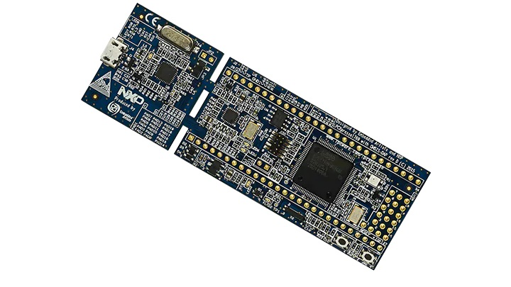

Additional Notes and Info for Multi target releases.

OBC - EMx Version (ClimbObc@TKN_RELEASE@-obc.axf)
---------------------------------------
This version runs on dedicated Climb OBC hardware.

     

DevBoard - BA_OM13085 Version (ClimbObc@TKN_RELEASE@-dev.axf)
---------------------------------------
This version runs on the developer board where some PIO pinnings are modified.

     

	Hardware needs fololowing external connections:

	J2-40	UART2 - TX
	J2-41   UART2 - RX	Debug Interface
  
  	J2-25   I2C - SDA
  	J2-26   I2C - SCI 	I2C connection to SRS Submodule
  
  	Optional:
  	J2-21   UART0 - TX
  	J2-22   UART0 - RX  	receiving GPS NMEA records ("$GPRMC,...")
  
  
