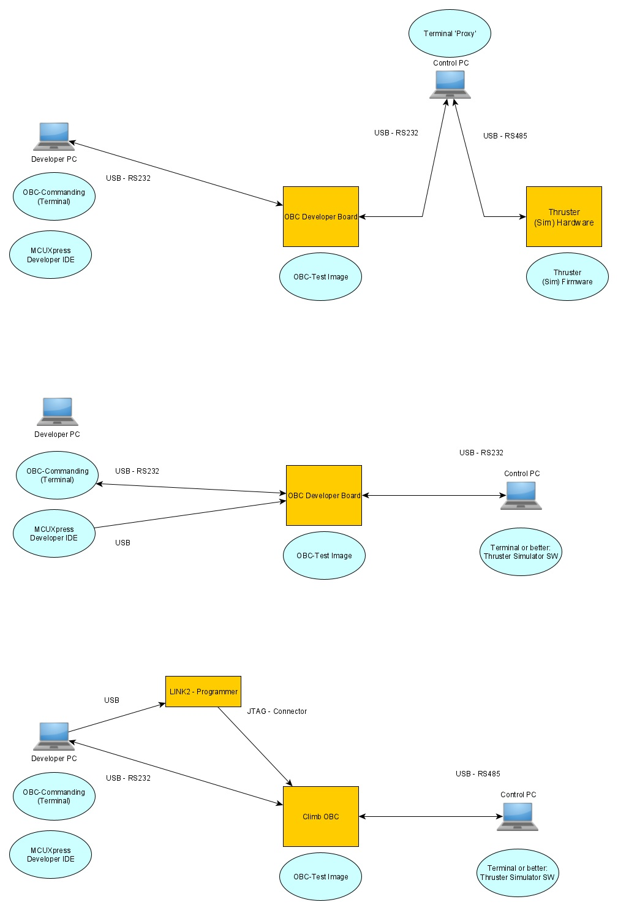

OBC-Software Architecture
=========================

Tool-Chain & External Dependencies
----------------------------------

The software for the OBC runs on dedicated hardware. The CPU used is a LPC1769 from NXP. 
Therefore the used IDE is NXP provided "MCUXpresso".

NXP delivers base libraries called "LPCOpen" which cover basic generalization of low level chip functions for a broad spectrum of NXP CPUs. Basis for the LPC1769 support is the "175x-6x"-version of this LPCOpen project framework. The last version of this code was delivered in 03/13/2014 (v2.10). The Chip is a ARM Cortex-M3 based CPU and there seems to be no more effort from NXP to include this CPU generation in new approaches to software development (like "MCUXpressos SDKs and SDK builders"). Therefore it was decided to use the latest version of the LPCOpen code as a starting point to adapt the existing features to the needs of this project. Development of this code is now done  [here](https://github.com/RobertK66/ado-chip-175x-6x) under the name "ADO-Library".

The project is written in C. The C standard library used and linked is the NXP delivered "REDLIB" in its "Redlib(none)" version.

Versions used (status 01-2022):
	- MCUXpresso IDE 		v11.1.1 
	-- arm-none-eabi-gcc		???
	-- redlib(none)		 	???
	- ADO-Lib 				\[master\] no release tag yet ...

Basic Architecture & Modularization
-----------------------------------

The project makes no use of any additional OS or RTOS code or libraries. It uses a self designed modularization approach based on a simple cooperative multitasking implementation.

Main goal of the modularization is to have core functionality for the OBC hardware in place. Additional external units should be 'plugable' dependent of chosen external connections 
and sub units in the final CubeSat system. 

Secondary goal is to have all developed modules available for different actual (e.g. test or prototyping versions) or future projects. This goal and therefore the scope of the ADO-Lib 
is limited to the LPC176x - LPC1769 chip.

To achieve this goals a strict layered approach is used:

 

  