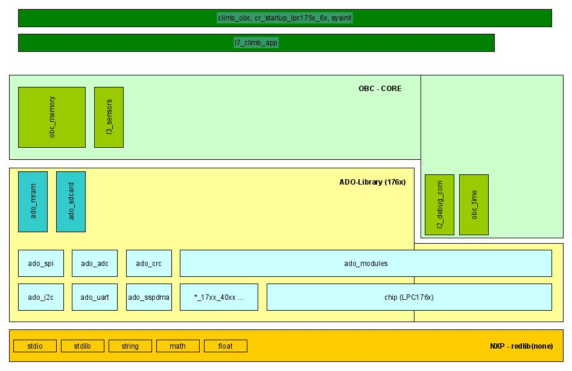

OBC-Software Architecture
=========================

For reasoning on the following facts see Appendix-A.

Tool-Chain & External Dependencies
----------------------------------

The software for the OBC runs on dedicated hardware. The CPU used is a LPC1769 from NXP. 
Therefore the used IDE is NXP provided "MCUXpresso". The projects follws the NXP "LPCOpen-project-layout" but iso IDE delivered "175x-6x" we use our own development based on NXPs code [here](https://github.com/RobertK66/ado-chip-175x-6x).
The project is written in C. The C standard library used and linked is the NXP delivered "REDLIB" in its "Redlib(none)" version.

Versions used (status 01-2022):

- MCUXpresso IDE: v11.1.1
	- arm-none-eabi-gcc: ???
	- redlib(none): ???
- ADO-Lib: \[master\] no release tag yet ...

Basic Architecture & Modularization
-----------------------------------

The project makes no use of any additional OS or RTOS code or libraries. It uses a self designed modularization approach based on a simple cooperative multitasking implementation.

Main goal of the modularization is to have core functionality for the OBC hardware in place. Additional external units should be 'plugable' dependent of chosen external connections 
and sub units in the final CubeSat system. 

Secondary goal is to have all developed modules available for different actual (e.g. test or prototyping versions) or future projects. This goal and therefore the scope of the ADO-Lib 
is limited to the LPC176x - LPC1769 chip.

To achieve this goals a layered approach is used:

 
  
