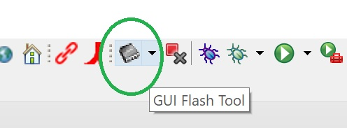
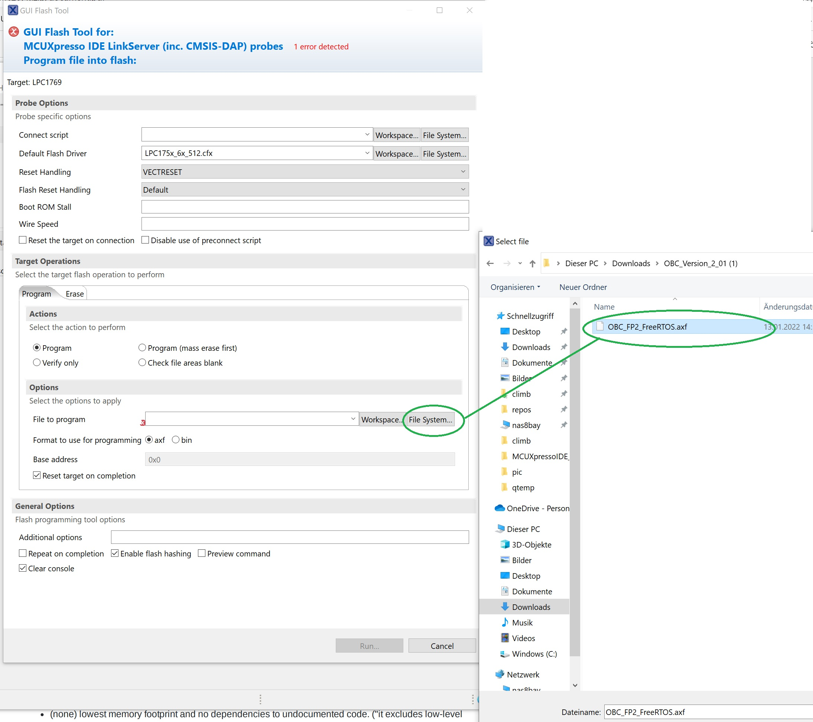
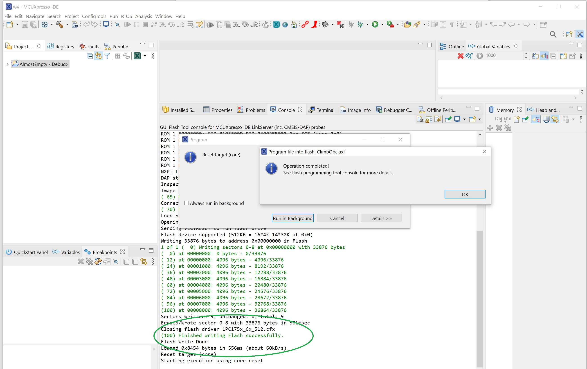

How to Program the OBCs Flash
=============================

- Connect a LPC-Link2 probe to the JTAG pins of the OBC Y- connector

- install and run a MCUXpresso developer IDE

- make an enpty C project - choose LPC1769 as target CPU. Do not choose any boards

- start the GUI Flash Tool from the MCUXpresso toolbar 

- select the axf file you want to program into your OBC

- run the toll and check if program was successful.

